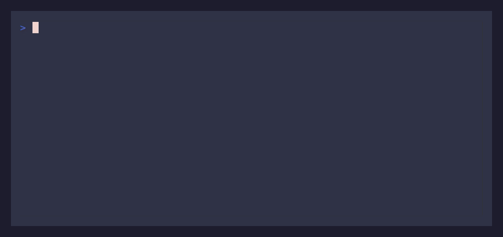

# cleansys (Clean System)

A minimalist CLI tool to systematically clean up digital clutter from your file system.

## Purpose
Help users identify and remove unnecessary files that accumulate unnoticed, promoting digital minimalism through focused, criteria-based cleanup.

## Core Features
- **Smart Scanning**: Find files by age, size, or type in specified folders
- **Interactive Review**: Approve each file or batch process with confidence
- **Safe Operations**: Preview before any deletion, with archive option
- **Zero Config**: All settings via command-line arguments

## Quick Start
```bash
# Scan Downloads for files not accessed in 6 months
cleansys ~/Downloads --unused-days 180

# Find large files over 50MB
cleansys ~/Desktop --min-size 50MB

# Combine criteria
cleansys ~/Documents --unused-days 365 --min-size 10MB
```

## CLI Demo



## Installation

Install with pip from a local clone:

```bash
git clone https://github.com/yourusername/cleansys
cd cleansys
python -m pip install .
```

After installation you can run the CLI directly as:

```bash
cleansys --help
cleansys ~/Downloads --unused-days 180
```

For development, you can still run it without installing:

```bash
python main.py ~/Downloads --unused-days 180
```

## Usage Workflow
1. **Scan**: Tool lists files matching your criteria
2. **Review**: Examine each file with metadata (size, last accessed)
3. **Act**: Choose to keep, move, archive, or delete
4. **Confirm**: All destructive actions require explicit confirmation

For a detailed, step-by-step walkthrough of prompts, actions, and the end-of-run
summary format, see `docs/userflow.md`, which is the canonical reference for the
interactive flow.

## Scope Limitations
- Local files only (no cloud integration)
- No automated deletions (user approval required)
- No file content analysis (metadata only)
- No background/scheduled operations

## Requirements
- Python 3.8+
- No external dependencies beyond standard library + CLI framework

## Commands & Options

- **Positional argument**
  - `path`: Root directory to scan (e.g., `~/Downloads`, `C:\\Users\\you\\Desktop`)

- **Common options**
  - `--unused-days INT`: Minimum days since last access (e.g., `--unused-days 180`)
  - `--min-size TEXT`: Minimum file size (supports units like `10MB`, `500KB`)
  - `--file-type TEXT`: Filter by extension (repeatable; e.g., `--file-type .log --file-type tmp`)
  - `--dry-run / --no-dry-run`: Show what would happen without making changes (honors the CLI default)

- **Interactive actions**
  - Review each file and choose: keep, move, archive, or delete
  - Batch operations are only performed after explicit confirmation

## Safety & Logging

- **Preview before actions**: Files, sizes, and last-access times are shown before any destructive operation.
- **Explicit confirmation**: Deletes and other destructive actions require a clear `y/yes` confirmation.
- **Dry-run mode**: When `--dry-run` is enabled, all actions are printed as `[DRY RUN] ...` messages and nothing on disk is changed.
- **Operation log**: All move/archive/delete attempts are logged to a `cleansys.log` file in the current working directory with timestamp, action, and path.
  - Real operations are logged as `MOVE`, `ARCHIVE`, or `DELETE`.
  - Dry-run previews are logged with a `[DRY RUN]` prefix.
  - Errors and warnings are logged with `[ERROR]` or `[WARN]` so you can review what was skipped or failed.

## Platform Support

cleansys is intended to be **cross-platform** and works on:
- **Windows** (PowerShell or Command Prompt)
- **macOS** (Terminal)
- **Linux** (common shells like bash/zsh)

Path examples in this README use Unix-style (`~/Downloads`) and Windows-style (`C:\\Users\\you\\Downloads`) paths; adjust them to match your system.

## License
MIT

## Contributing
Focus on simplicity. Reject features that add complexity without clear benefit.
